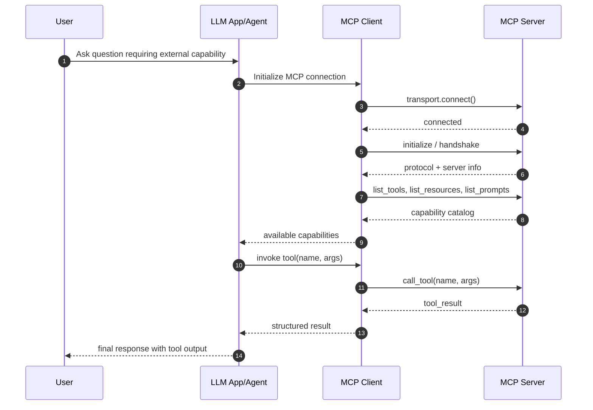

# mcp_inandout

This repository is a starter workspace for experimenting with Model Context Protocol (MCP) integrations.

## MCP Protocol Gist

MCP is a standard protocol that lets an AI app (client) talk to external capability providers (servers).

At a high level:
- Client = orchestrator used by your LLM app
- Server = provider of tools/resources/prompts
- Protocol = structured request/response + notifications over a transport

Core primitives:
- `tools`: callable actions with typed inputs/outputs
- `resources`: retrievable context/data blobs
- `prompts`: reusable prompt templates

Typical flow:
1. Client opens transport connection to server (`stdio`, `sse`, `websocket`, or `http` depending on implementation).
2. Client initializes and discovers server capabilities.
3. Model decides a tool call from user intent.
4. Client sends tool invocation to server.
5. Server executes and returns structured result.
6. Client feeds result back into the model response loop.

Why MCP matters:
- Decouples model logic from integration code.
- Makes tools portable across different frameworks/agents.
- Keeps a clear boundary between reasoning (LLM) and execution (server).

## Transport Difference: SSE vs STDIO

Both are valid MCP transports, but they fit different deployment styles.

| Topic | STDIO | SSE |
|---|---|---|
| Process model | Client spawns server as a child process | Server is usually a long-running network service |
| Communication path | Local process pipes (stdin/stdout) | HTTP stream over network |
| Setup complexity | Low for local development | Higher (host, port, endpoint, network) |
| Best use case | Local tools, single-machine workflows | Remote/shared tools, multi-client access |
| Security surface | Mostly local process boundary | Network exposure, auth/TLS needed |
| Reliability concerns | Child process lifecycle and pipe handling | Connectivity, timeouts, proxy/load balancer behavior |
| Scaling style | Scale by spawning more processes | Scale service instances behind network infrastructure |

Quick rule of thumb:
- Use STDIO for fast local iteration and private workstation tooling.
- Use SSE when tools must run as remotely reachable services.

## MCP Client/Server Lifecycle Diagram



## MCP Update: Client vs Server

### MCP Server
An MCP server exposes capabilities to AI applications in a standard way.

Typical responsibilities:
- Publish tools (functions the model can call)
- Publish resources (structured content the model can read)
- Optionally publish prompts/templates
- Handle transport and authentication

Think of the server as: "What can be offered?"

### MCP Client
An MCP client connects to one or more MCP servers and makes those capabilities available to an LLM-driven app.

Typical responsibilities:
- Discover server tools/resources
- Route model tool calls to the right server
- Collect results and return them to the model/app
- Manage connection lifecycle and error handling

Think of the client as: "How does the app consume those capabilities?"

## How They Work Together

1. Client connects to server transport (stdio, stream, websocket, etc.)
2. Client fetches advertised tools/resources
3. LLM selects a tool based on user intent
4. Client invokes server tool and receives output
5. Output is fed back into the model response

## Current Project Status

- `main.py` currently contains a minimal async app skeleton.
- `pyproject.toml` already includes MCP-friendly dependencies such as `langchain-mcp-adapters`.

## Suggested Next Implementation Steps

1. Add an `mcp_server.py` that exposes 1-2 simple tools (for example, math or file metadata).
2. Add an `mcp_client.py` that connects to the server and prints discovered tools.
3. Wire the client into a LangChain/LangGraph flow so tool calls can be agent-driven.
4. Add `.env.example` for required keys and runtime settings.

## Run

```bash
uv run main.py
```

For the current LangChain + MCP multi-server example:

```bash
uv run langchain_client.py
```

### Difference Between `main.py` Client and `langchain_client.py` Client

- `main.py`:
	Uses a low-level MCP client session (`ClientSession`) with manual lifecycle steps (`stdio_client` -> `initialize` -> `load_mcp_tools`).
- `main.py`:
	Connects to one local MCP server (`math_server.py`) over STDIO.
- `main.py`:
	Best for learning MCP internals and debugging the handshake/session flow.

- `langchain_client.py`:
	Uses `MultiServerMCPClient`, a higher-level adapter that manages multiple server connections for you.
- `langchain_client.py`:
	Aggregates tools from more than one server (for example math + weather) into one toolset for the agent.
- `langchain_client.py`:
	Best for application-style orchestration where an agent can choose from multiple MCP tool providers.